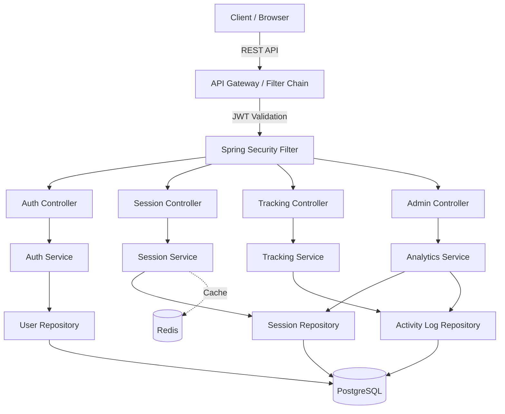

# E-Commerce Session Tracking System — Implementation Plan

A production-grade Spring Boot backend for tracking user sessions in an e-commerce platform. Supports JWT authentication, session lifecycle management, activity tracking, analytics, and Redis-backed session caching.

## System Architecture



**Data Flow**: Login → JWT issued + Session created → Each request validated via JWT filter → Activity tracked asynchronously → Logout invalidates session + token blacklisted.

**Architecture**: Modular monolith with layered architecture (Controller → Service → Repository). Components are decoupled via interfaces for future microservice extraction.

---

## Proposed Changes

All files are **[NEW]** since this is a greenfield project in `/Users/karthikeyadevatha/Documents/DEV/timecom`.

### Project Configuration

#### [NEW] [pom.xml](file:///Users/karthikeyadevatha/Documents/DEV/timecom/pom.xml)
Maven project with: Spring Boot 3.2+, Spring Security, Spring Data JPA, PostgreSQL driver, Spring Data Redis, JJWT library, Lombok, Spring Boot Starter Validation, Spring Boot Starter Test.

#### [NEW] [application.yml](file:///Users/karthikeyadevatha/Documents/DEV/timecom/src/main/resources/application.yml)
Database, Redis, JWT secret, session timeout configuration.

---

### Database Schema & Entities

#### SQL Schema (auto-generated by JPA, with Flyway migration for reference)

| Table | Key Columns |
|-------|-------------|
| `users` | id, username, email, password_hash, role, created_at, updated_at |
| `sessions` | id, user_id (FK), token, ip_address, user_agent, device_type, is_active, created_at, expires_at, last_activity_at |
| `activity_logs` | id, session_id (FK), user_id (FK), action_type (enum), resource_path, resource_id, metadata (JSONB), ip_address, timestamp |

**Indexes**: `sessions(user_id, is_active)`, `sessions(token)`, `sessions(expires_at)`, `activity_logs(session_id)`, `activity_logs(user_id, timestamp)`, `activity_logs(action_type)`.

#### [NEW] Entity files in `src/main/java/com/timecom/sessiontracker/entity/`
- `User.java` — JPA entity with BCrypt password, role enum
- `Session.java` — Session entity with lifecycle fields
- `ActivityLog.java` — Event log with action type enum

#### [NEW] Enums in `src/main/java/com/timecom/sessiontracker/entity/enums/`
- `Role.java` — USER, ADMIN
- `ActionType.java` — LOGIN, LOGOUT, PAGE_VIEW, PRODUCT_VIEW, ADD_TO_CART, REMOVE_FROM_CART, CHECKOUT, SEARCH
- `DeviceType.java` — DESKTOP, MOBILE, TABLET, UNKNOWN

---

### Security & Authentication

#### [NEW] Security files in `src/main/java/com/timecom/sessiontracker/security/`
- `JwtTokenProvider.java` — Generate, validate, parse JWT tokens (JJWT library)
- `JwtAuthenticationFilter.java` — OncePerRequestFilter for JWT validation
- `SecurityConfig.java` — Spring Security config (stateless, CORS, CSRF disabled, endpoint rules)
- `CustomUserDetailsService.java` — Loads user from DB for Spring Security

#### [NEW] [AuthController.java](file:///Users/karthikeyadevatha/Documents/DEV/timecom/src/main/java/com/timecom/sessiontracker/controller/AuthController.java)
- `POST /api/auth/login` — Authenticate, issue JWT, create session
- `POST /api/auth/logout` — Invalidate session, blacklist token
- `POST /api/auth/register` — User registration

---

### Session Management

#### [NEW] [SessionService.java](file:///Users/karthikeyadevatha/Documents/DEV/timecom/src/main/java/com/timecom/sessiontracker/service/SessionService.java)
Full lifecycle: create (on login), validate (per request), refresh (extend expiry), expire (timeout/logout), list user sessions, terminate specific session.

#### [NEW] [SessionController.java](file:///Users/karthikeyadevatha/Documents/DEV/timecom/src/main/java/com/timecom/sessiontracker/controller/SessionController.java)
- `GET /api/sessions/current` — Get current session info
- `GET /api/sessions` — List all user sessions
- `POST /api/sessions/refresh` — Refresh session expiry
- `DELETE /api/sessions/{id}` — Terminate a specific session

---

### Activity Tracking

#### [NEW] [TrackingService.java](file:///Users/karthikeyadevatha/Documents/DEV/timecom/src/main/java/com/timecom/sessiontracker/service/TrackingService.java)
Async event logging with `@Async`. Handles page views, product views, cart actions, checkout.

#### [NEW] [TrackingController.java](file:///Users/karthikeyadevatha/Documents/DEV/timecom/src/main/java/com/timecom/sessiontracker/controller/TrackingController.java)
- `POST /api/track` — Log a user activity event
- `GET /api/track/history` — Get activity history for current user

---

### Analytics & Admin

#### [NEW] [AnalyticsService.java](file:///Users/karthikeyadevatha/Documents/DEV/timecom/src/main/java/com/timecom/sessiontracker/service/AnalyticsService.java)
Aggregated stats: active sessions count, sessions by device, activity breakdown by type, daily active users, user journey reconstruction.

#### [NEW] [AdminController.java](file:///Users/karthikeyadevatha/Documents/DEV/timecom/src/main/java/com/timecom/sessiontracker/controller/AdminController.java)
- `GET /api/admin/sessions` — All active sessions (admin only)
- `GET /api/admin/analytics/summary` — Dashboard summary stats
- `GET /api/admin/analytics/activity` — Activity breakdown
- `DELETE /api/admin/sessions/{id}` — Force-terminate session

---

### DTOs & Exception Handling

#### [NEW] DTOs in `src/main/java/com/timecom/sessiontracker/dto/`
- `LoginRequest`, `RegisterRequest`, `AuthResponse`
- `SessionResponse`, `SessionListResponse`
- `TrackEventRequest`, `ActivityResponse`
- `AnalyticsSummaryResponse`, `ActivityBreakdownResponse`
- `ApiErrorResponse`

#### [NEW] Exception handling in `src/main/java/com/timecom/sessiontracker/exception/`
- `GlobalExceptionHandler.java` — `@RestControllerAdvice` for 400/401/403/404/500
- `SessionExpiredException`, `InvalidTokenException`, `UserNotFoundException`

---

### Configuration & Utilities

#### [NEW] Config files
- `AsyncConfig.java` — Enable async processing with thread pool
- `RedisConfig.java` — Redis template configuration
- `CorsConfig.java` — CORS settings

#### [NEW] [SessionCleanupScheduler.java](file:///Users/karthikeyadevatha/Documents/DEV/timecom/src/main/java/com/timecom/sessiontracker/scheduler/SessionCleanupScheduler.java)
Scheduled task to expire stale sessions (runs every 15 minutes).

---

### Flyway Migration

#### [NEW] [V1__init_schema.sql](file:///Users/karthikeyadevatha/Documents/DEV/timecom/src/main/resources/db/migration/V1__init_schema.sql)
Complete DDL with tables, indexes, constraints, and seed data (admin user).

---

## Security Design

| Concern | Implementation |
|---------|---------------|
| Authentication | JWT (HS512), 1-hour access token |
| Session hijacking | Token bound to IP + User-Agent; mismatch = invalidation |
| CSRF | Disabled (stateless API, token-based) |
| Password storage | BCrypt with strength 12 |
| Rate limiting | Simple in-memory rate limiter on login endpoint |
| Headers | X-Content-Type-Options, X-Frame-Options, Strict-Transport-Security |
| Input validation | Bean Validation (`@Valid`) on all request DTOs |

## Scalability Strategy

| Aspect | Approach |
|--------|----------|
| Session cache | Redis as primary session lookup; DB as persistent store |
| Async tracking | `@Async` with configurable thread pool for activity logging |
| Stale session cleanup | Scheduled background task |
| Horizontal scaling | Stateless JWT + shared Redis = any instance can handle any request |
| Database | Indexed queries, JSONB for flexible metadata, connection pooling (HikariCP) |

---

## Verification Plan

### Automated Tests

All tests run via Maven:
```bash
cd /Users/karthikeyadevatha/Documents/DEV/timecom
./mvnw test
```

| Test Class | Type | Covers |
|-----------|------|--------|
| `JwtTokenProviderTest` | Unit | Token generation, validation, expiry, invalid tokens |
| `SessionServiceTest` | Unit | Session CRUD, expiration, multi-session, refresh |
| `TrackingServiceTest` | Unit | Event logging, async behavior |
| `AuthControllerIntegrationTest` | Integration | Login, logout, register API flows |
| `SessionControllerIntegrationTest` | Integration | Session endpoints with auth |
| `TrackingControllerIntegrationTest` | Integration | Tracking endpoints |

**Edge case tests**: expired sessions, invalid/malformed tokens, concurrent sessions, rate limiting trigger, session with mismatched IP.

### Manual Verification

> [!IMPORTANT]
> PostgreSQL and Redis must be running locally (or via Docker) before starting the app.

1. **Start the app**: `./mvnw spring-boot:run`
2. **Register a user**: `POST /api/auth/register` with JSON body
3. **Login**: `POST /api/auth/login` → receive JWT token
4. **Track activity**: `POST /api/track` with Bearer token
5. **View sessions**: `GET /api/sessions/current` with Bearer token
6. **Admin analytics**: `GET /api/admin/analytics/summary` with admin token
7. **Logout**: `POST /api/auth/logout` → verify session invalidated
8. **Expired token**: Wait for token expiry, retry → expect 401

> [!NOTE]
> Integration tests use `@SpringBootTest` with an embedded H2 database (test profile), so PostgreSQL is **not required** for running `./mvnw test`.
